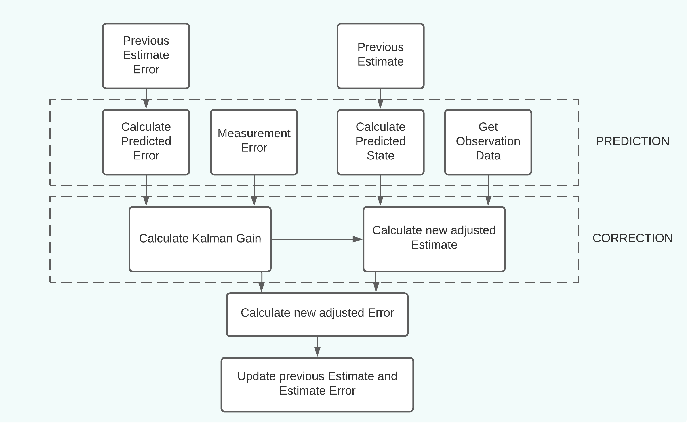
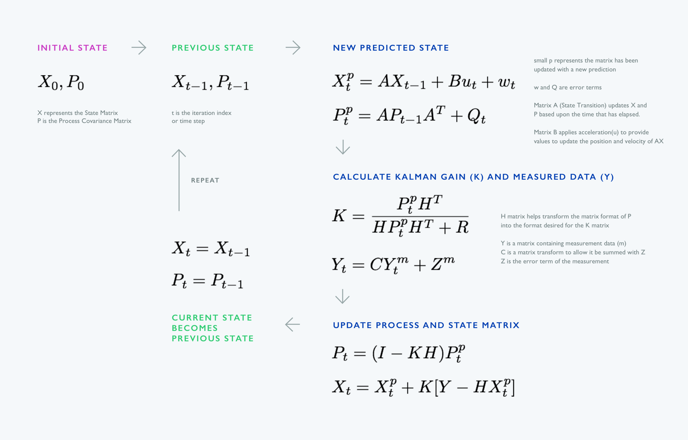

# Kalman Filter - 1D motion example - Assignment 1

## 1. What is a Kalman Filter?
The Kalman filter is a probabilistic state estimator technique which is used to make an optimal estimation of the state of a dynamical system. It can also be explained as a recursive algorithm which consists of two main steps - Prediction & Correction. The prediction step takes, for example, the steering information of a vehicle or the motion control commands into account, in order to estimate, in order to predict, where the system will be at the next point in time. The correction step takes into account the sensor observation, in order to improve our prediction and adjust for potential errors.

The Kalman filter makes two important assumptions. The first one is that everything is Gaussian, i.e. sensor observations, errors, and noise follow a normal (gaussian) distribution. The second assumption is that all models are linear, i.e. the model that estimates where the system will be at the next point in time and the observation model of the sensor data are both linear models.

However, it is important to realize that we live in a non-linear world where non-Gaussian distributions are the standard. The Extended Kalman Filter (EKF) is a variant of the Kalman Filter that tries to deal with these nonlinearities. The EKF performs a Taylor approximation (i.e. local linearization) of the non-linear models at a given measurement point. 

---

## 2. Flowchart of the Kalman Filter



---

## 3. Implementation in Python

1. Define initial conditions:
> The process covariance matrix corrects itself in the process of iterations, however we should initially make an educated guess of what the error in the first predicted state will be.
```
a = 1  # Acceleration [m/s^2]
x_0 = 0  # Position [m]
v_0 = 0  # Velocity [m/s]
t = 0.1  # Time step [s]

x_err_process = 9  # Position uncertainty for the first prediction [m]
v_err_process = 2  # Velocity uncertainty for the first prediction [m/s]

x_err_measure = 10  # Position uncertainty in observation data [m]
v_err_measure = 1  # Velocity uncertainty in observation data [m]

prev_state = np.array([x_0, v_0]).transpose()
prev_process_covariance = P
```
2. Initialize process covariance matrix:
> The covariance elements in the process covariance matrix are set to 0, based on the assumption that variable 'x' is independent of the other variable 'v'. No adjustments are made to the estimates of one variable due to the process error of the other variable
```
P = np.array([[x_err_process ** 2, 0], [0, v_err_process ** 2]])
```
3. Calculate the predicted state:
> State noise (covariance matrix) - predicted errors in the state due to external factors influencing the system; external forces acting on the object, e.g. friction, wind gust, water currents.
```
A = np.array([[1, t], [0, 1]])
B = np.array([[0.5 * (t ** 2)], [t]])

state_estimate = A.dot(prev_state) + B.dot(control_variable_matrix) + noise_matrix
```
4. Calculate the predicted process covariance matrix (error in the state estimate):
> Process noise (covariance matrix) - keeps the covariance matrix from becoming too small or 0. It can be the result of given noise in the control variables. (e.g. acceleration noise)
```
process_covariance_estimate = A @ prev_process_covariance @ A.transpose() + noise_matrix

process_covariance_estimate = np.diag(np.diag(process_covariance_estimate))
```
5. Calculate measurement covariance matrix (error in the state measurement):
```
R = np.array([x_err_measure ** 2, 0], [0, v_err_measure ** 2])
```
6. Calculate the Kalman gain (weighting factor)
```
H = np.identity(2)
denominator = H @ process_covariance_estimate @ H.transpose() + measurement_covariance

kalman_gain = process_covariance_estimate @ H @ np.linalg.inv(denominator)
```
7. Take a measurement of the state
> Measurement noise (covariance matrix) - errors due to unknown factors of the equipment, temperature variations, filter inaccuracies, etc. and can not be predicted, but are known not to exceed certain values.
```
C = np.identity(2)

state_measurement = C.dot(measured_state) + noise_matrix
```
8. Calculate adjusted state based on the predicted state, measured state, and kalman gain
```
H = np.identity(2)

adjusted_state = state_estimate + kalman_gain @ (state_measurement - (H @ state_estimate)
```
9. Calculate adjusted process covariance based on the kalman gain
```
I = np.identity(2)
H = np.identity(2)
adjusted_process_covariance = (I - kalman_gain @ H) @ process_covariance_estimate

adjusted_process_covariance = np.diag(np.diag(process_covariance))
```
10. Update previous state & covariance matrix
```
prev_state = adjusted_state
prev_process_covariance = adjusted_process_covariance
```
11. Repeat